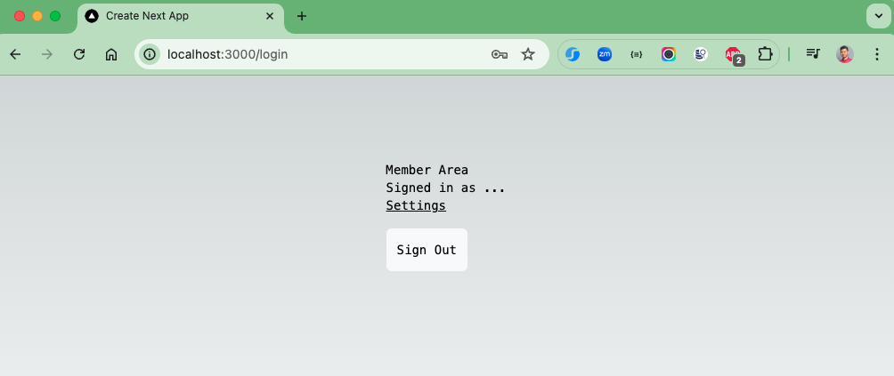
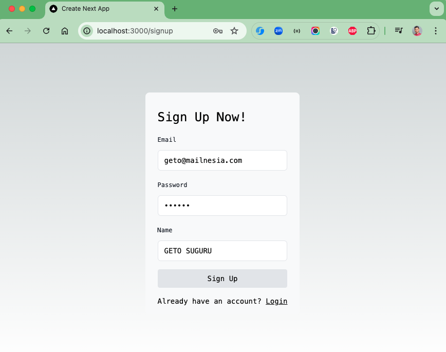
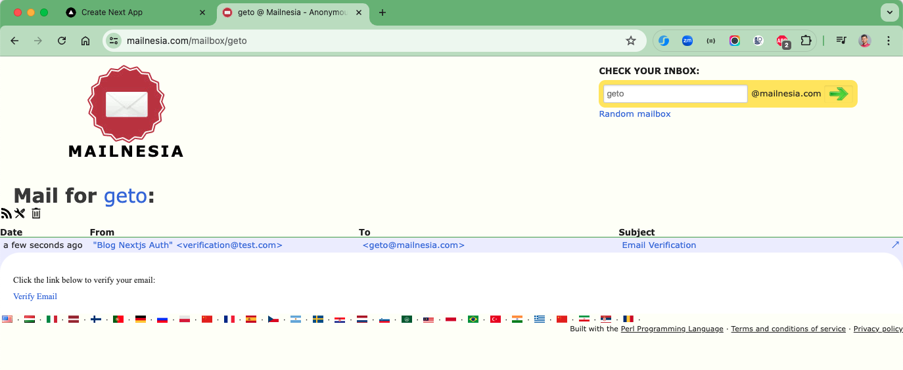
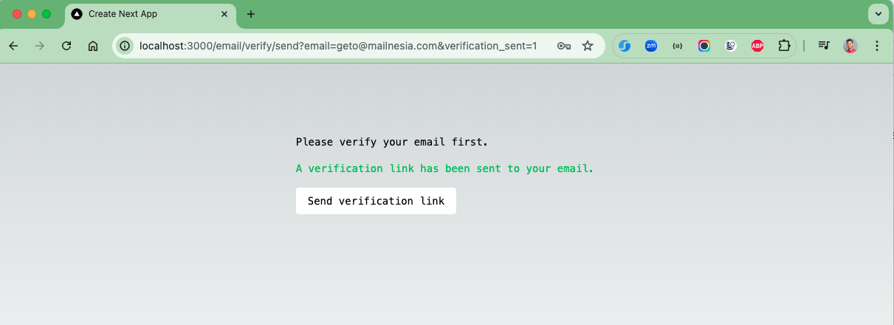
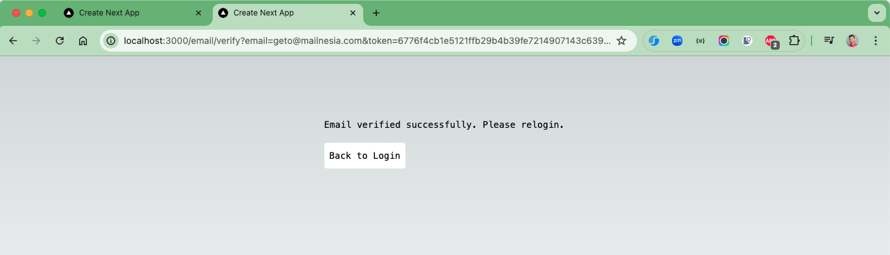
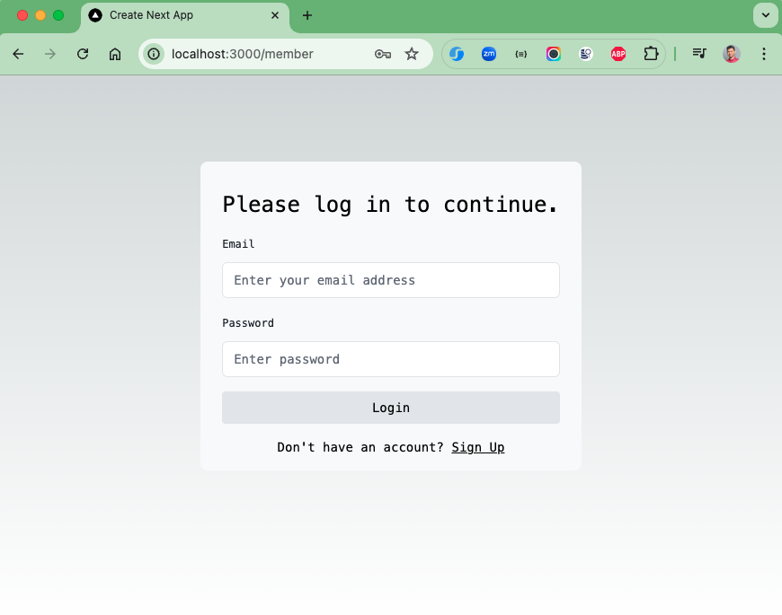
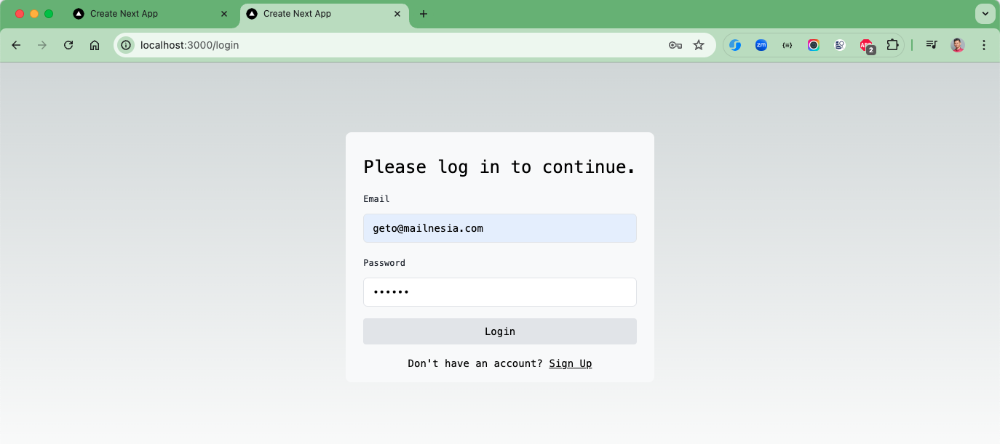
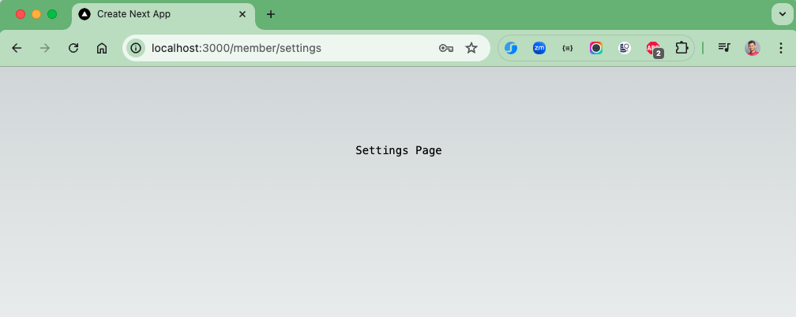

# Email Authentication and Verification in Next.js 14 With Next Auth and Prisma

This is an implementation of Email-Password Authentication and Verification with Next.js 14.
A blog about this can be found
here: [Email Authentication and Verification in Next.js 14 With Next Auth and Prisma | Fajarwz](https://fajarwz.com/blog/email-authentication-and-verification-in-nextjs-14-with-next-auth-and-prisma/).

## Things todo list

1. Clone this repository: `git clone https://github.com/hendisantika/nextjs14-auth.git`
2. Navigate to the folder: `cd nextjs14-auth`
3. Run the command to install the required libs: `pnpm install`
4. Run PostgreSQL Database via Docker Compose: `docker compose up`
5. Run the Web App: `cp .env.example .env`
6. Run the Web App: `pnpm dev`
7. Open your favorite browser: http://localhost:3000/member

### Create .env file from .env.example

```
cp .env.example .env
```

### Database Integration

1. Open .env file
2. Create a database and connect it with Next.js by adjusting the `DATABASE_URL` with your own configuration

### Migrate the Database Migration

```
npx prisma db push
```

## Installation

### Node Packages

```
npm install
```

## Run App

```
npm run dev
```

### Image Screenshot

Home Page



SignUp User



Email



Verify User





Login Page





Settings

